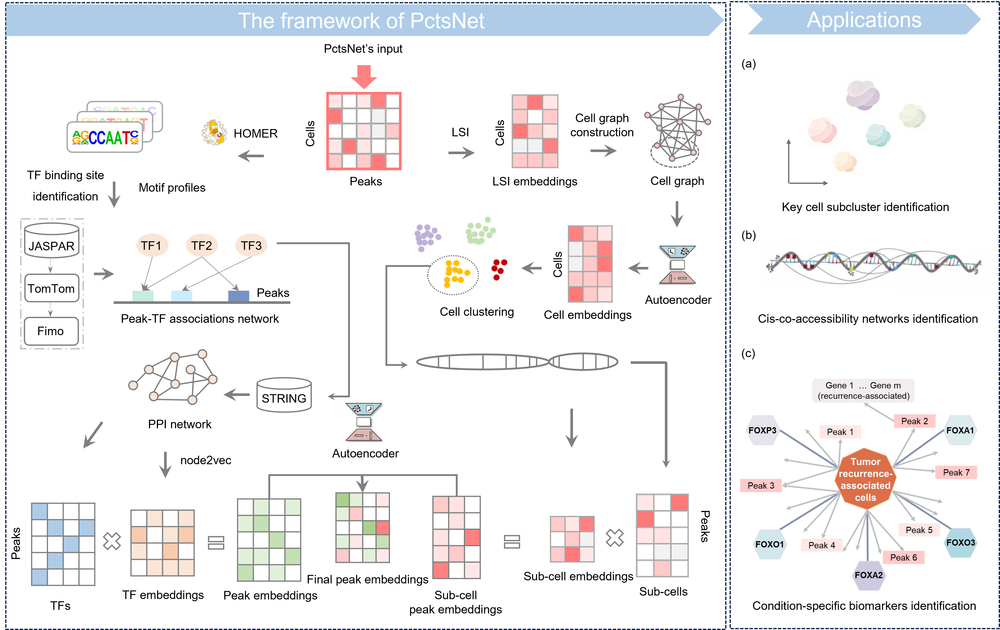

<h1 align="center">PctsNet: Prediction of cell type-specific cis-regulatory networks from scATAC-seq data using graph neural networks</h1>

## Description

PctsNet: Single-cell analysis for cell type-specific cis-regulatory network prediction using graph neural networks, an end-to-end deep learning model for regulatory interaction inference from scATAC-seq data.

  

## Installation

### System Requirements

* Python Version >=3.8.0
* Hardware Architecture: x86_64
* Operating System: GNU/Linux or Windows or MacOS

### Dependencies, MarsGT has the following dependencies:

* anndata==0.8.0
* dill==0.3.4
* matplotlib==3.5.1
* numpy==1.22.3
* pandas==1.4.2
* scipy==1.9.1
* seaborn==0.11.2
* scikit-learn==1.1.2
* torch==1.12.0
* torch-geometric==2.1.0.post1
* torchmetrics==0.9.3
* xlwt==1.3.0
* tqdm==4.64.0
* scanpy==1.9.1
* leidenalg==0.8.10
* ipywidgets==8.0.6
